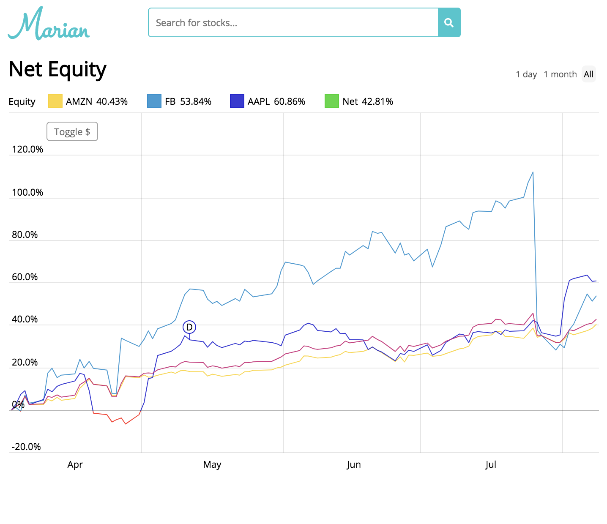

# Marian

[Marian](https://marian.crystalprism.io) is an [Angular](https://angular.io/) web app that allows you to visualize real-time stock data, generate a graph of net equity for each stock in your portfolio, and read the latest market and stock news. Marian was created as a counterpart to [Robinhood](https://robinhood.com/) but also stands on its own, as users can enter share data for each stock in their portfolio to see how it contributes to their net equity over time. Marian displays up to 20 years' worth of data for each stock, as well as company information, using [Alpha Vantage](https://www.alphavantage.co/)'s global stocks API. It also gets real-time stock prices and market news from [Finnhub](https://finnhub.io/)'s API. Marian's graphs are built from the [amCharts](https://www.amcharts.com/) library, and its search bar is powered by [Algolia](https://www.algolia.com/).

## Setup
1. Clone this repository locally or on your server.
2. Go to the project root directory, and install the required dependencies by running `npm install`.
3. Run `ng serve` for a dev server. Navigate to `http://localhost:4200/`. The app will automatically reload if you change any of the source files. Run `ng build` to build the project. The build artifacts will be stored in the `dist/` directory. Use the `--prod` flag for a production build.
