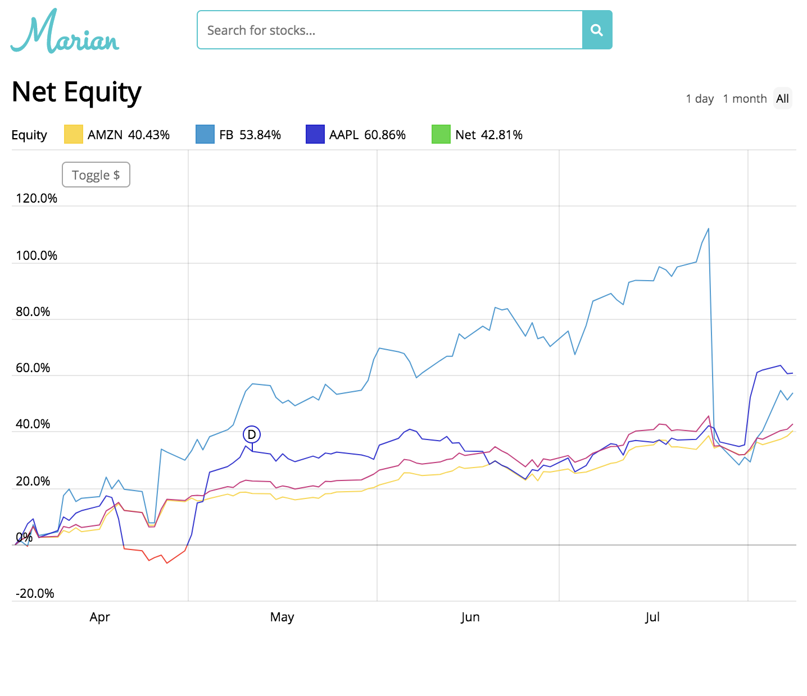

# Marian


[Marian](https://marian.crystalprism.io) is an [Angular](https://angular.io/) web app that allows you to visualize real-time stock data, generate a graph of net equity for each stock in your portfolio, and read the latest market and stock news. Marian was created as a counterpart to [Robinhood](https://robinhood.com/) but also stands on its own, as users can enter share data for each stock in their portfolio to see how it contributes to their net equity over time. Marian displays up to 100 trading days' worth of data for each stock, as well as company information, using [Alpha Vantage](https://www.alphavantage.co/)'s global stocks API. It also gets real-time stock prices and market news from [Finnhub](https://finnhub.io/)'s API. Marian's graphs are built from the [amCharts](https://www.amcharts.com/) library, and its search bar is powered by [Algolia](https://www.algolia.com/).

## Setup
1. Clone this repository locally or on your server.
2. Make sure you are running a supported version of [Node.js](https://nodejs.org/) (the LTS pinned in `.nvmrc`; run `nvm use` if you use [nvm](https://github.com/nvm-sh/nvm)).
3. From the project root, install dependencies with `npm install`.
4. Install the [Netlify CLI](https://docs.netlify.com/cli/get-started/) once: `npm install -g netlify-cli`. It runs the app together with the API proxy locally (see "API keys & the serverless proxy" below).
5. Copy `.env.example` to `.env` and fill in your API keys.
6. Run `npm start`, then navigate to `http://localhost:8888/`. This serves the Angular app **and** the serverless functions (so live prices, charts, company info, and news work) and reloads automatically when you change a source file.

## Common commands
- `npm start` — run the full local stack (app + API proxy) via `netlify dev` on port 8888. **Use this** for live data.
- `npm run serve` — run only the Angular dev server (`ng serve`, port 4200). The UI loads, but `/api/*` calls won't work, so prices/charts/news stay empty.
- `npm run build` — build a production bundle into `dist/marian/browser` (production is the default configuration).
- `npm test` — run the unit tests (Vitest).
- `npm run lint` — lint the project with ESLint.

## API keys & the serverless proxy
The Alpha Vantage and Finnhub API keys are **never shipped to the browser**. All
upstream calls go through [Netlify Functions](https://docs.netlify.com/functions/overview/)
in `netlify/functions/*`, which read the keys from environment variables and call
the third-party APIs server-side. The app calls these via `/api/*` (see `netlify.toml`).

Required environment variables (see `.env.example`):

| Variable           | Used by                         |
| ------------------ | ------------------------------- |
| `ALPHAVANTAGE_KEY` | `daily` + `company` functions   |
| `FINNHUB_KEY`      | `quote` + `news` functions      |

- **Local development:** copy `.env.example` to `.env`, fill in your keys, then run
  `npm start` (which runs `netlify dev` — install the
  [Netlify CLI](https://docs.netlify.com/cli/get-started/) once with
  `npm i -g netlify-cli`). This serves the Angular app and the functions together on
  http://localhost:8888 so `/api/*` works locally.
- **Production:** set `ALPHAVANTAGE_KEY` and `FINNHUB_KEY` in the Netlify dashboard
  (Site settings → Environment variables). The Algolia search bar uses a public,
  search-only key, which is safe to ship in the client.

## Refreshing the stock list
The list of tickers (`src/app/stocks.ts`, `src/app/symbols.ts`) and the Algolia
search index are generated from [Alpha Vantage](https://www.alphavantage.co/)'s
`LISTING_STATUS` feed. To refresh them with the latest active US-listed symbols:

```bash
# Regenerate the local data files only:
npm run refresh-tickers

# Also re-index Algolia search (requires a write-capable admin key):
ALGOLIA_ADMIN_KEY=your-admin-key npm run refresh-tickers
```

Supported environment variables: `ALPHAVANTAGE_KEY`, `ALGOLIA_APP_ID`,
`ALGOLIA_INDEX`, and `ALGOLIA_ADMIN_KEY`. The Algolia **admin** key is
write-capable — pass it only at runtime and never commit it.
